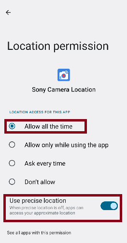

# Sony Camera Location Tool

An android App for location and remote control on Sony camera. This App tries to make the best possible speed of location and the stability of the connection to camera.

## Permission requirements

Bluetooth, Location and Notification permissions are all necessary otherwise the software refuses to run. Most mobile phones require users to manually turn on the location permission of "Allow all the time" in the system interface.

## Paring first

Before connecting the camera, users should complete the Bluetooth pairing between the phone and the camera in the system interface.

## Faith speed mode

If this switch is turned on, the App will try to use some methods to speed up the connection with the camera, but it may lead to more compatibility issues.

## Compatibility

The minimum Android version requirement is 13.

Currently only tested on my Xiaomi phone (Android 13) and Sony A7CR and expected me to have no other testing environment either.

## Known issues

In very few cases, the connection symbol appears on the camera, but the positioning symbol does not appear on the camera for a long time (more than 10 seconds). When this happens, you can try to turn the camera back off and on, if it doesn't work, the next thing to try is to exit and re-enter the software, or even turn off the Bluetooth switch and re-open to clear the cache that may be behind.

In order to reduce power consumption, sometimes the Android system will go into hibernation, and the positioning symbol on the camera will disappear, at this time, press the power button to activate it.

Sometimes there will be positioning deviations, but the positioning accuracy comes from the Android phone itself. This App cannot identify the  deviations and avoid this problem, and can only use the underlying data. And in order to reduce power consumption, it will not locate when the camera is not connected, so the underlying data will have a certain inertia. If you have just arrived in a new place far from last place, it is recommended to wait for about 20 seconds for the new positioning data to stabilize.

In addition, if you open some well-known map software, the system will most likely use their commercial-grade positioning assistance, which will improve the positioning accuracy.

## Looks like

## Permissions needed

