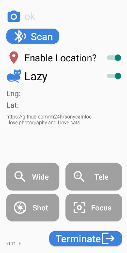

# Sony Camera Location Tool

An android App for location and remote control on Sony camera

## Permission requirements

Bluetooth, location and Notification permissions are all necessary otherwise the software refuses to run. Most mobile phones require users to manually turn on the permission of "Background/Always Positioning" in the system interface.

## Paring first

Before connecting the camera, users should complete the Bluetooth pairing between the phone and the camera in the system interface.

## Compatibility

Currently only tested on my Xiaomi phone and Sony A7CR and expected me to have no other testing environment either.

## Known issues

Sometimes the connection symbol appears on the camera, but the positioning symbol does not appear for a long time. When this happens, you can try to turn the camera back off and on, if it doesn't work, the next thing is to exit and re-enter the software, or even turn off the Bluetooth switch and re-open to clear the cache that may be behind.

## Looks like

