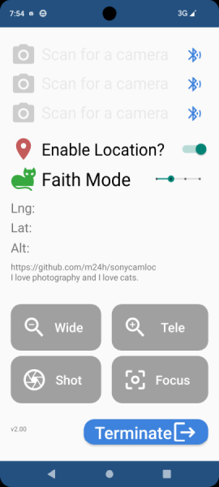
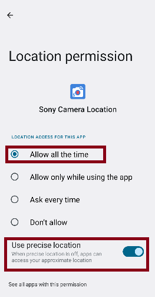
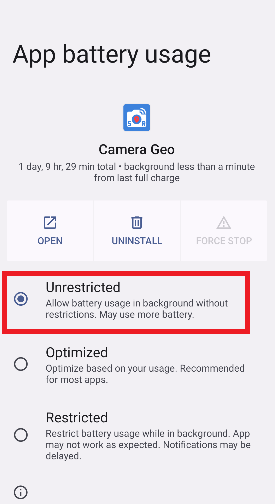

# Camera Geo (original: Sony Camera Location Tool)

An android App for geo-tag and remote control on cameras. This App tries to make the best possible speed of location and the stability of the connection to camera.

In addition to Sony's cameras, Ricoh's cameras are now supported (although it can be seen from the repository name that it was originally developed for Sony cameras only), and the software framework also makes it very easy to add support for other cameras (but I don't have other kinds of cameras right now).

It is now possible to connect up to three cameras at the same time, such as a primary camera, a spare camera, and a DC camera.

## Permission requirements

Bluetooth, Location and Notification permissions are all necessary otherwise the software refuses to run. 

Important: Most mobile phones require users to manually turn on the location permission of "Allow all the time" in the system interface.

It's best to manually cancel the automatic battery optimization for this App on the relevant Android setting interface. "Unrestricted" is recommended.

## Paring first

For most kinds of cameras, before connecting the camera, users should complete the Bluetooth pairing between the phone and the camera in the system interface.

## Faith speed mode

If the switch is turned to the far right,, the App will try to use some methods to speed up the connection with the camera, but it may lead to more compatibility issues. At the moment, it's only tweaked for my A7CR and an Android 13 phone, which may not work well and may even slow things down.

If the switch is turned to the far left, two potentially unstable location data will be discarded, before sending location information to the camera. There will be positioning deviations, but the positioning accuracy comes from the Android phone itself. This App cannot identify the  deviations and avoid this problem, and can only use the underlying data. And in order to reduce power consumption, it will not locate when the camera is not connected, so the underlying data will have a certain inertia. If you have just arrived in a new place far from last place, it is recommended to use this gear and wait for the new positioning data to stabilize.

In addition, if you open some well-known map software, the system will most likely use their commercial-grade positioning assistance, which will improve the positioning accuracy.

The other gears will take balance in speed and precision.

## Compatibility

The minimum Android version requirement is 13.

Currently only tested on my Xiaomi phone (Android 13) and Sony A7CR and Ricoh GR3, and expected me to have no other testing environment either.

## Known issues

In very few cases, the program will not be able to complete the Bluetooth connection (this seems to be related to the connection of other Bluetooth devices, but it is still difficult to reproduce, not enough bug information has been captured), at this time you need to quit the software and reopen it.

In order to reduce power consumption, sometimes the Android system will go into hibernation, and the positioning symbol on the camera will disappear, at this time, press the power button to activate it.

The remote control interface is only for the first camera (the top one). If it is a Ricoh camera, the shooting will put the camera into single frame mode, because I have not yet mastered the control method of continuous shooting.

## Looks like

## Permissions needed

