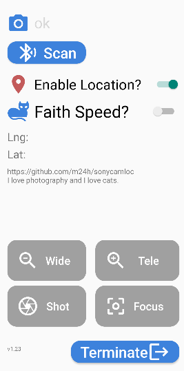

# Sony Camera Location Tool

An android App for location and remote control on Sony camera.

## Permission requirements

Bluetooth, Location and Notification permissions are all necessary otherwise the software refuses to run. Most mobile phones require users to manually turn on the location permission of "Allow all the time" in the system interface.

## Paring first

Before connecting the camera, users should complete the Bluetooth pairing between the phone and the camera in the system interface.

## Compatibility

The minimum Android version requirement is 13.

Currently only tested on my Xiaomi phone (Android 13) and Sony A7CR and expected me to have no other testing environment either.

## Known issues

Sometimes the connection symbol appears on the camera, but the positioning symbol does not appear on the camera for a long time. When this happens, you can try to turn the camera back off and on, if it doesn't work, the next thing to try is to exit and re-enter the software, or even turn off the Bluetooth switch and re-open to clear the cache that may be behind.

In order to reduce power consumption, sometimes the Android system will go into hibernation, and the positioning symbol on the camera will disappear, at this time, press the power button to activate it.

## Looks like

## Permissions needed

